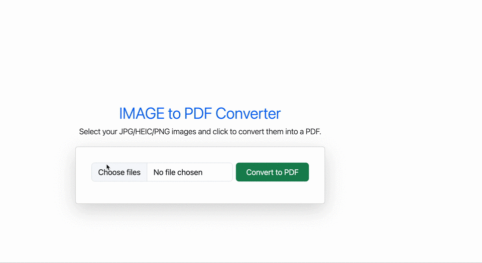

# JPG/PNG/HEIC to PDF Converter
A simple and fast web app to convert `JPG, JPEG, PNG, or HEIC` images into a `single PDF` — all on the client side using `JavaScript` and `PDF-Lib`.

## Table of Contents

- [Features](#Features)
- [File Structure](#File-Structure)
- [Technologies Used](#Technologies-Used)
- [How to Use](#How-to-Use)
- [Demo](#Demo)
- [Setup](#Setup)
- [Author](#Author)

## Features
- Convert multiple `JPG, JPEG, PNG, or HEIC` images into a `single PDF`.
- Built with Bootstrap for a clean, responsive UI.
- 100% client-side — no server or upload required.
- Drag & drop support for multiple files.
- Automatic download of the generated PDF.
- Including notification.

## File Structure
- project-root/
- ├── index.html        # Main HTML file with Bootstrap UI
- ├── index.js          # JavaScript logic for image-to-PDF conversion
- └── README.md         # Project documentation

## Technologies Used
- **HTML5**, **CSS3**, **Bootstrap** – For responsive layout and styling.
- **JavaScript** with [PDF-Lib](https://pdf-lib.js.org/) – To generate PDF files directly in the browser.

## How to Use
1. Open `index.html` in your browser.
2. Upload one or more `JPG, JPEG, PNG, or HEIC` files using the file input or drag & drop area.
3. Click the **Convert to PDF** button.
4. The generated PDF will be downloaded automatically.

## Demo
  
*A quick demonstration of how images are uploaded, validated, previewed, and seamlessly converted into a PDF — with **toast notifications** for actions like file upload, errors, and completion — all in the browser without any server interaction.*

## Setup
To run the project locally:
- Clone the repository: `git clone https://github.com/amitesh786/ConvertPDF.git`
- cd ConvertPdf
Then, simply open `index.html` in your browser to get started.

## Author
- Developed by Amitesh Singh | © 2025
- Feel free to contribute or suggest improvements!
